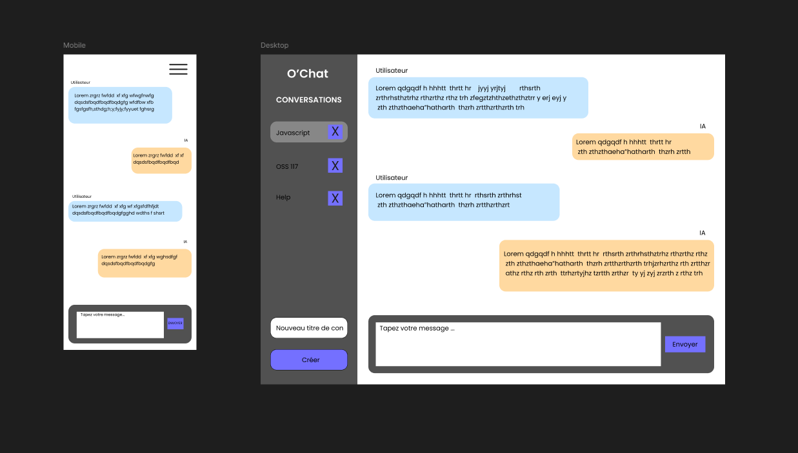

# O'Chat

Ce projet permet de mettre en application les compétences de développeur front-end en réalisant une interface utilisateur permettant d'interagir avec l'API du LLM Mistral.

## Fonctionnalités principales

- Gestion des Messages
- Gestion du Token d'Authentification
- Gestion des Conversations

## Etapes

1. J1 - Mise en place du projet Svelte et intégration HTML/CSS
2. J2 - Implémentation de l'échange de messages avec Mistral
3. J3 - Persistance des données à l'aide de Pocketbase pour conserver l'historique de messages
4. J4 - Implémentation d'un système de conversations

## Technologies utilisées

- **Framework Frontend** : Svelte
- **Backend API** : Pocketbase pour stocker les messages et conversations
- **API IA** : Service externe (ex : Mistral AI)
- **Stockage** : LocalStorage pour la gestion du token API

## Résultat final

